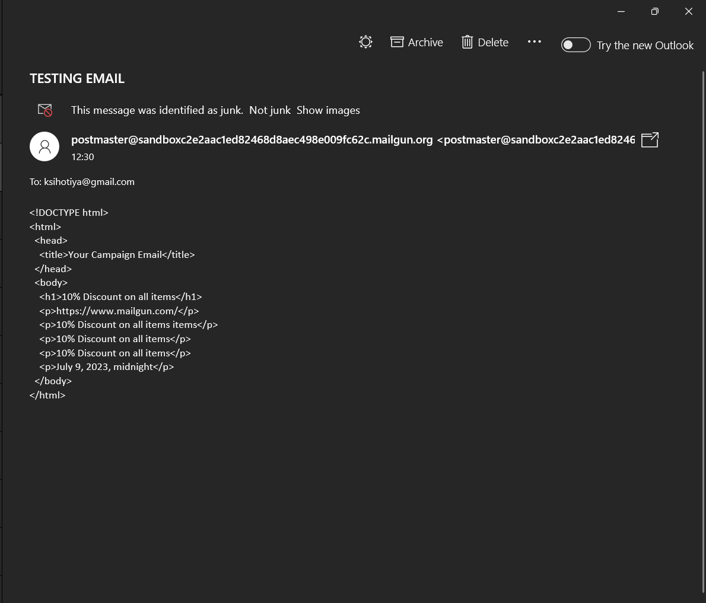
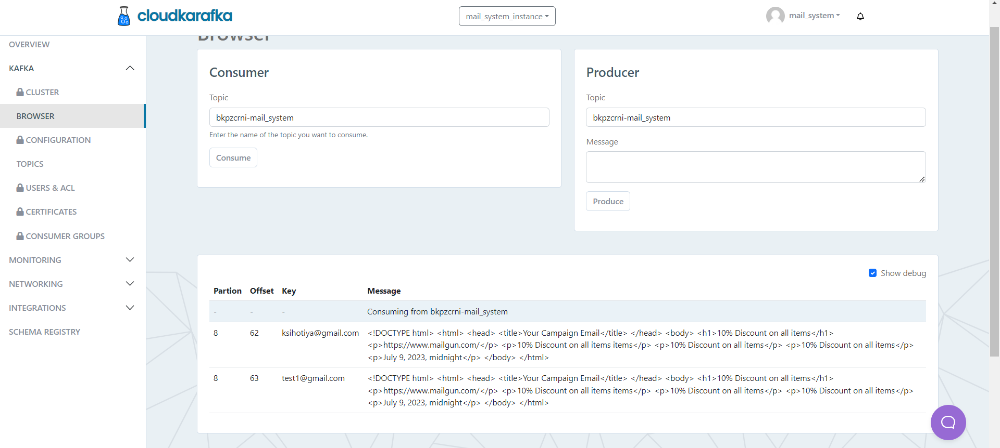

### Django application for sending emails regarding campaigns to subscribed user.

- Commands for running the application

  ```
  python manage.py runserver
  ```

  ```
  python manage.py kafka_consumer
  ```

- Command for migrations

  ```
  python manage.py makemigrations
  ```

  ```
  python manage.py migrate
  ```

## Subscribers

**`Models`**

```yml
subscribers
|-- models
|--Subscribers
|-- email
|-- first_name
|-- is_active
```

**`Urls`**

<i>Endpoint for adding a subscriber to our database</i>

```yml
subscribers/add
```

<i>Endpoint for getting all subscribers from our database</i>

```yml
subscribers/list
```

<i>endpoint for updating a subscriber in our database</i>

```yml
subscribers/update/<pk:int>
```

<i>endpoint for deleting a subscriber from our database</i>

```yml
subscribers/delete/<pk:int>
```

## Campaigns

**`Models`**

```yml
campaigns
|--models
|--Campaigns
|--subject
|--preview_text
|--article_url
|--html_content
|--plain_text_content
|--published_date
|--is_active
```

**`Urls`**

<i>Endpoint for getting list of all campaigns</i>

```yml
campaigns/list
```

<i>Endpoint for getting details of a particular campaign</i>

```yml
campaigns/details/<int:pk>
```

<i>Endpoint for updating a campaign</i>

```yml
campaigns/update/<int:pk>
```

<i>Endpoint for deleting a campaign</i>

```yml
campaigns/delete/<int:pk>
```

<i>Endpoint for sending emails regarding this campaign to all subscribers</i>

```yml
campaigns/send_email/<int:pk>
```

## Database


Used PostgreSQL for storing data about subscribers and campaigns and hosted this database using [Render](render.com)

## Emailing

<a href="https://www.mailgun.com/"></a>

Used free account provided by mailgun for testing and sending emails using SMTP. Currently for testing only 5 mails are allowed to authorized in order to recieve mails. These mails can be authorized through mailgun console only, there is not public API to authorize the mails. So unable to confiure any logic for authorizing any subscriber to recieve mails via code.

#### Resulting mails regarding campaigns



## Publisher-Subscriber(Pub-Sub) using Kafka

Created consumer and producer using kafka for sending campaign emails to our subscriber. Deployed the kafka using Cloudkarafka.

<a href="https://www.cloudkarafka.com/"></a>

Created a topic on kafka with 3 replicas, on which these producer and consumer listen. As soon as someone hit send campaign, all the subscribed mails will get store in kafka as key-value pair, from where consumer will consume them.



## MultiThreading

Created 4 threads so that kafka consumer can consume and send these email parllely.

```yml
def handle(self, *args, **kwargs):

        threads = []

        def consume_and_send_email():

            consumer.subscribe(['bkpzcrni-mail_system'])
            while True:
                msg = consumer.poll(100.0)

                print(msg)

                if msg is None:
                    continue

                if msg.error():
                    if msg.error().code() == KafkaError._PARTITION_EOF:
                        continue
                    else:
                        print(msg.error())
                        break

                recipient = msg.key().decode('utf-8')
                message = msg.value().decode('utf-8')

                # Send the email
                try:
                    send_mail(
                        "TESTING EMAIL",
                        message,
                        None,
                        [recipient],
                        fail_silently=False,
                    )

                except smtplib.SMTPException as e:
                    continue

        for i in range(4):

            thread = threading.Thread(target=consume_and_send_email)
            thread.start()
            threads.append(thread)

        for thread in threads:
            thread.join()


```
